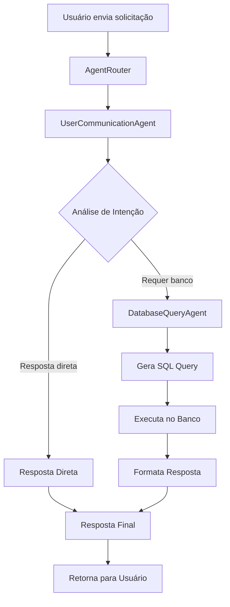

# Sistema de Agentes Inteligentes

Este diretório contém o sistema de agentes responsável pela comunicação com o usuário e processamento de consultas.

## Arquitetura do Sistema

### 🎯 **AgentRouter** (Roteador Principal)
- **Arquivo**: `agentRouter.ts`
- **Função**: Coordena qual agente usar baseado na solicitação do usuário
- **Responsabilidades**:
  - Analisar intenção do usuário
  - Rotear para o agente apropriado
  - Gerenciar metadados de processamento
  - Tratar erros e fallbacks

### 🗣️ **UserCommunicationAgent** (Agente de Comunicação)
- **Arquivo**: `userCommunicationAgent.ts`
- **Função**: Agente principal responsável pela comunicação com o usuário
- **Responsabilidades**:
  - Analisar intenção do usuário
  - Decidir se precisa consultar banco de dados
  - Gerar respostas diretas para perguntas gerais
  - Coordenar outros agentes especializados

### 🗄️ **DatabaseQueryAgent** (Agente de Banco de Dados)
- **Arquivo**: `databaseQueryAgent.ts`
- **Função**: Agente especializado em consultas ao banco de dados
- **Responsabilidades**:
  - Gerar queries SQL baseadas na solicitação
  - Executar consultas no banco de dados
  - Formatar respostas com dados obtidos
  - Tratar erros de consulta

### 🔧 **Agent** (Agente Base)
- **Arquivo**: `agents.ts`
- **Função**: Classe base para agentes simples
- **Responsabilidades**:
  - Fornecer interface básica para agentes
  - Gerenciar comunicação com OpenAI

## Fluxo de Processamento



## Como Usar

### 1. Importar o sistema de agentes

```typescript
import { AgentRouter } from '../agents/agentRouter';
```

### 2. Criar instância do roteador

```typescript
const agentRouter = new AgentRouter();
```

### 3. Processar solicitação

```typescript
const result = await agentRouter.routeRequest(userPrompt, conversationHistory);
```

### 4. Acessar resultado

```typescript
console.log('Resposta:', result.response);
console.log('Agente usado:', result.agentUsed);
console.log('Requer banco:', result.requiresDatabase);
console.log('Tempo de processamento:', result.processingTime);
```

## Tipos de Solicitações

### 📊 **Consultas que Requerem Banco de Dados**
- Perguntas sobre dados específicos
- Solicitações de estatísticas
- Consultas sobre relatórios municipais
- Perguntas que precisam de dados da tabela `relatorio_texto`

**Exemplos**:
- "Quantos relatórios temos?"
- "Mostre dados sobre saúde"
- "Quais são os investimentos em educação?"

### 💬 **Respostas Diretas**
- Saudações e cumprimentos
- Perguntas sobre o funcionamento do sistema
- Explicações conceituais
- Perguntas que não requerem dados específicos

**Exemplos**:
- "Olá, como funciona o sistema?"
- "O que você pode fazer por mim?"
- "Explique sobre ações municipais"

## Metadados de Resposta

O sistema retorna metadados úteis para debug e monitoramento:

```typescript
{
  response: string;           // Resposta formatada em HTML
  agentUsed: string;          // Agente utilizado
  requiresDatabase: boolean;   // Se consultou banco
  processingTime: number;     // Tempo de processamento (ms)
  confidence: number;         // Confiança na resposta (0-1)
  databaseData?: any;        // Dados do banco (se aplicável)
  sqlQuery?: string;         // Query SQL executada (se aplicável)
}
```

## Configuração

O sistema usa a configuração centralizada:

```typescript
import { Config } from '../config/config';

// Verificar se API key está configurada
if (Config.isOpenAIKeyValid()) {
  // Usar agentes
}
```

## Tratamento de Erros

O sistema possui tratamento robusto de erros:

1. **Erro de API Key**: Retorna instruções de configuração
2. **Erro de Banco**: Tenta fallback com query simples
3. **Erro de Processamento**: Retorna resposta de erro amigável
4. **Timeout**: Implementa timeouts para evitar travamentos

## Logs e Debug

O sistema gera logs detalhados:

```typescript
console.log('AgentRouter: Routing request:', prompt);
console.log('User intent analysis:', analysisResult);
console.log('Generated SQL query:', sqlQuery);
console.log('Database query executed, rows returned:', result.rows?.length);
```

## Extensibilidade

Para adicionar novos agentes:

1. Criar nova classe de agente
2. Implementar interface comum
3. Adicionar lógica de roteamento no `AgentRouter`
4. Atualizar análise de intenção no `UserCommunicationAgent`

## Vantagens do Sistema

- ✅ **Modular**: Cada agente tem responsabilidade específica
- ✅ **Inteligente**: Decide automaticamente qual agente usar
- ✅ **Robusto**: Tratamento de erros e fallbacks
- ✅ **Monitorável**: Metadados detalhados de processamento
- ✅ **Extensível**: Fácil adicionar novos agentes
- ✅ **Eficiente**: Otimizado para diferentes tipos de consulta
